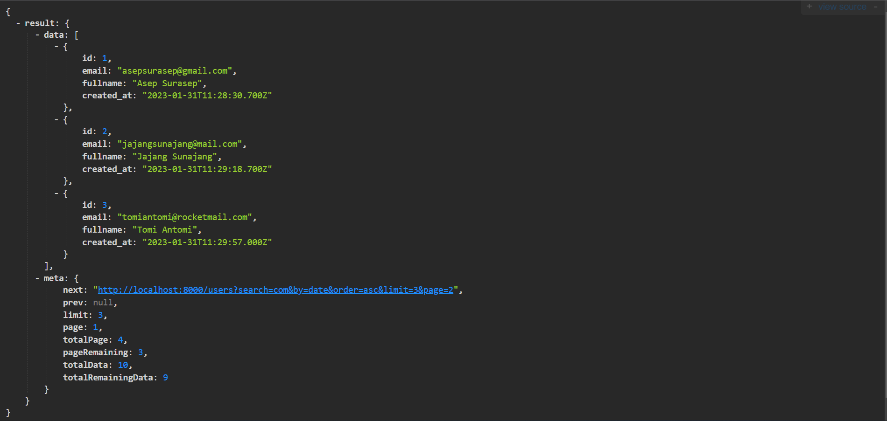
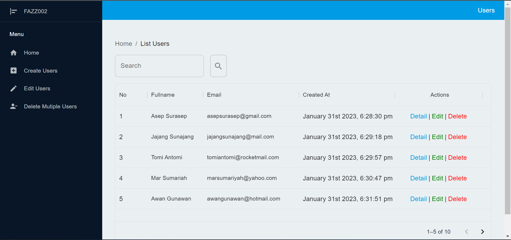
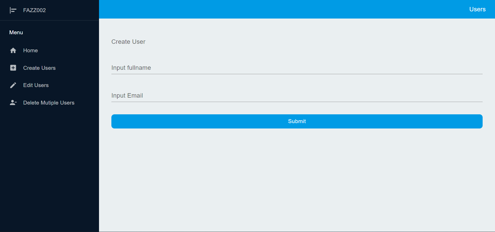
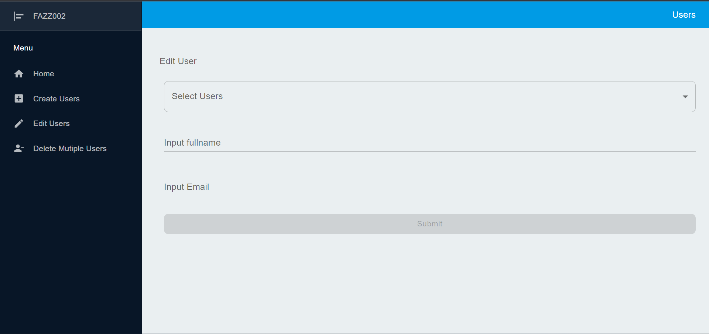

# FAZZ002 SI Users

  <br/>

## How Run to Local

### Import assets

---

- import database MysQL
- import collections postman for API platform

#### POSTMAN Collections

or look api collections postman :
<https://api.postman.com/collections/18051667-4d4cd4d9-44bd-4f45-ad28-fcc554faaf40?access_key=PMAT-01GR3T1Y66KFSK1RKV6VW418HV>

##### Documentations :

###### `Documentation SI Users` <https://documenter.getpostman.com/view/18051667/2s935iu6NK>

  <br/>

### How Run Server

---

into directory :

```
cd server
```

install Dependencies :

```
npm install
```

Setup Envirotment File :
<br/>
create an .env file in the server folder, and copy the contents of .env.example to .env

run app :

```
npm run start
```

or (always restart after change coding/develop mode)

```
npm run dev
```

Open http://localhost:8000 or your ipv4/virtual host, example : http://192.168.56.258:8000 to view it in your browser.

<br/>

### How Run Client

---

into directory :

```
cd client
```

install Dependencies :

```
npm install
```

Setup Envirotment File :
<br/>
create an .env file in the server folder, and copy the contents of .env.example to .env

run app :

```
npm run dev
```

Open http://localhost:5173

<br />

### Screenshot

---

- Server/Backend

  

- Client/Frontend

  screenshot every page :
  <br/>

  - Home

    

  - Create

    

  - Edit

     

  - Delete

     

<br/>

### example Deployment

---

### `Rest Api` <https://fazz002-si-users-api.vercel.app>

### `Frontend` <https://fazz002-si-users-react.vercel.app>
